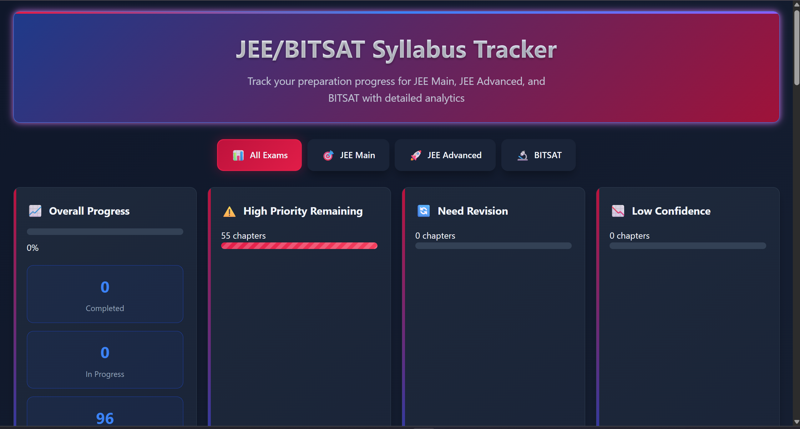

# Entrance Exam Progress Tracker

A specialized web application designed for candidates preparing for competitive engineering entrance examinations (JEE/BITSAT). This tool enables structured syllabus management and real-time progress monitoring across Physics, Chemistry, and Mathematics.

**Live Link:** https://ujeshauchitha-glitch.github.io/Entrance-exam-progress-tracker-website/

## Technical Features

### 1. Dynamic Data Management
The application utilizes a centralized JSON-like data structure to manage hundreds of chapters. It features a filtering engine that allows users to sort topics by:
* Subject (Physics, Chemistry, Math)
* Completion status
* Exam relevance (JEE Main vs. BITSAT)

### 2. Progress Persistence
Integrated with browser **LocalStorage API**, ensuring that all user input, notes, and completion statuses are preserved across sessions without requiring a backend database.

### 3. Analytics Dashboard
A real-time calculation engine translates raw completion data into visual progress bars and percentage metrics, providing immediate feedback on syllabus coverage.

## Architecture
* **Frontend:** Built with vanilla HTML5 and CSS3 using a custom dark-mode UI designed for long study sessions.
* **Logic:** Modular JavaScript for DOM manipulation and state management.
* **Responsive Design:** Optimized for both desktop and mobile viewing to allow for quick updates during study breaks.
